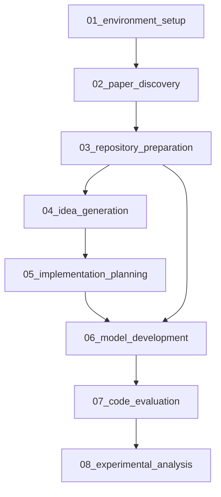

# AI-Researcher Pipeline

## Overview

This directory contains the AI-Researcher system converted into a modular, numbered pipeline format. The original research automation system has been decomposed into 8 discrete, reproducible steps that can be executed independently or as a complete pipeline.

## Pipeline Architecture

### Step-by-Step Breakdown

```
01_environment_setup     → Initialize Docker environment and workspace
02_paper_discovery      → Search ArXiv and GitHub for relevant papers/repos  
03_repository_preparation → Select and download reference codebases
04_idea_generation      → Generate/refine research ideas through LLM analysis
05_implementation_planning → Create detailed implementation plans and datasets
06_model_development    → Implement ML models with training/testing code
07_code_evaluation      → Evaluate code quality and refine implementation
08_experimental_analysis → Run experiments and generate research reports
```

### Dependency Graph



## Quick Start

### Prerequisites

- Docker Engine 20.10+
- Python 3.11+
- 16GB+ RAM recommended
- GPU support (NVIDIA Docker) for ML training
- API keys for LLM services (OpenAI, Anthropic, etc.)

### Environment Setup

1. **Configure API Keys**
   ```bash
   export OPENAI_API_KEY="your-openai-key"
   export ANTHROPIC_API_KEY="your-anthropic-key"
   export GITHUB_TOKEN="your-github-token"  # Optional but recommended
   ```

2. **Install Dependencies**
   ```bash
   pip install docker pydantic python-dotenv arxiv PyGithub
   ```

3. **Make Scripts Executable**
   ```bash
   chmod +x steps/run_pipeline.sh
   chmod +x steps/*/run.sh
   chmod +x steps/*/test.sh
   ```

### Execution Options

#### Option 1: Complete Pipeline (Recommended)

```bash
cd steps/
./run_pipeline.sh
```

This executes all 8 steps sequentially with automatic output propagation.

#### Option 2: Individual Step Execution

```bash
# Execute specific step
cd steps/01_environment_setup/
./run.sh

# Test specific step
cd steps/02_paper_discovery/  
./test.sh
```

#### Option 3: Partial Pipeline

```bash
# Run specific range of steps
cd steps/
for step in {01..05}*; do
    cd "$step" && ./run.sh && cd ..
done
```

## Configuration

### Research Categories

The pipeline supports multiple research domains:

- **vq**: Vector Quantization (VQ-VAE, discrete representations)
- **gnn**: Graph Neural Networks (GCN, GraphSAGE, etc.)
- **recommendation**: Recommendation Systems (collaborative filtering)
- **diffu_flow**: Diffusion Models and Flow Matching
- **reasoning**: Logical and Causal Reasoning

### Input Configuration

Edit `01_environment_setup/inputs/config.json`:

```json
{
  "category": "vq",
  "completion_model": "gpt-4o-2024-08-06",
  "cheep_model": "gpt-4o-mini",
  "workspace_name": "workplace",
  "task_level": "task1",
  "max_iter_times": 3
}
```

### Search Configuration  

Edit `02_paper_discovery/inputs/search_config.json`:

```json
{
  "category": "vq",
  "keywords": ["vector quantization", "VQ-VAE"],
  "max_papers": 20,
  "max_github_repos": 30,
  "date_limit": "2020-01-01"
}
```

## Output Structure

Each step produces structured outputs in its `outputs/` directory:

```
steps/
├── 01_environment_setup/outputs/
│   ├── environment_status.json    # Setup validation results
│   ├── docker_config.json        # Container configuration  
│   └── workspace/                 # Research workspace
├── 02_paper_discovery/outputs/
│   ├── paper_metadata.json       # Discovered papers
│   ├── github_repositories.json  # Relevant repositories
│   └── search_summary.json       # Search statistics
├── 08_experimental_analysis/outputs/
│   ├── experimental_results.json # Final research results
│   ├── research_paper_draft.md   # Auto-generated paper
│   └── figures/                  # Generated visualizations
└── ...
```

## Pipeline Modes

### Level 1: Detailed Idea Implementation

Implement a user-provided research idea:

1. Place your idea in `04_idea_generation/inputs/user_idea.txt`
2. Set `"mode": "detailed_idea"` in config
3. Run pipeline - it will implement your specific idea

### Level 2: Reference-Based Ideation  

Generate novel ideas from reference papers:

1. Set `"mode": "reference_based"` in config
2. Run pipeline - it will analyze papers and generate ideas
3. System selects best idea for implementation

## Key Features

### 🔄 **Reproducible Execution**
- Each step is completely isolated
- Deterministic input/output interfaces
- Comprehensive logging and validation

### 🐳 **Containerized Environment**
- Docker-based execution for consistency
- GPU support for ML training
- Isolated dependencies per step

### 📊 **Comprehensive Outputs**
- Research paper drafts in Markdown
- Complete ML project codebases
- Experimental results and visualizations
- Quality evaluation reports

### 🔧 **Modular Design**
- Run individual steps independently  
- Easy to modify or extend
- Clear dependency management

### ⚡ **Automated Pipeline**
- End-to-end execution with single command
- Intelligent error handling and recovery
- Progress tracking and logging

## Troubleshooting

### Common Issues

1. **Docker Permission Denied**
   ```bash
   sudo usermod -aG docker $USER
   newgrp docker
   ```

2. **GPU Not Available**
   - Install nvidia-docker2
   - Verify with `docker run --gpus all nvidia/cuda:11.8-base-ubuntu20.04 nvidia-smi`

3. **API Rate Limits**
   - Add `GITHUB_TOKEN` for higher limits
   - Use cheaper models in config for testing

4. **Out of Memory**
   - Reduce batch sizes in model configs
   - Use smaller datasets for testing
   - Increase Docker memory allocation

### Validation

Each step includes comprehensive validation:

```bash
# Test all steps
for step in steps/{01..08}*; do
    echo "Testing $step..."
    cd "$step" && ./test.sh && cd -
done
```

### Monitoring

Pipeline execution generates detailed logs:

```bash
# View real-time pipeline progress
tail -f steps/pipeline_execution_*.log

# Check individual step status
cat steps/01_environment_setup/outputs/environment_status.json
```

## Advanced Usage

### Custom Paper Sources

Add benchmark papers to `02_paper_discovery/inputs/benchmark_instance.json`:

```json
{
  "instance_id": "custom_vq_research",
  "source_papers": [
    {
      "reference": "Neural Discrete Representation Learning",
      "usage": "Core VQ-VAE methodology"
    }
  ]
}
```

### Dataset Integration

Configure custom datasets in `05_implementation_planning/inputs/dataset_catalog.json`:

```json
{
  "datasets": [
    {
      "name": "CIFAR-10",
      "category": "image_classification", 
      "size": "60000 samples",
      "download_url": "...",
      "preprocessing": "normalize to [-1, 1]"
    }
  ]
}
```

### Model Architectures

Extend architecture designs in step 05 for custom models:

```json
{
  "model_type": "vq_vae",
  "encoder": {
    "type": "convolutional",
    "layers": [64, 128, 256, 512],
    "activation": "relu"
  },
  "quantization": {
    "codebook_size": 512,
    "embedding_dim": 64
  }
}
```

## Performance Expectations

### Execution Times

| Step | Typical Duration | Resource Usage |
|------|------------------|----------------|
| 01   | 2-5 minutes     | Low CPU/Memory |
| 02   | 10-15 minutes   | Network I/O    |
| 03   | 20-30 minutes   | Disk I/O       |
| 04   | 45-60 minutes   | LLM API calls  |
| 05   | 30-45 minutes   | LLM API calls  |
| 06   | 90-120 minutes  | High GPU/CPU   |
| 07   | 30-45 minutes   | LLM API calls  |
| 08   | 60-90 minutes   | GPU/CPU        |

**Total Pipeline: 4-6 hours**

### Resource Requirements

- **Minimum**: 8GB RAM, 4 CPU cores, 50GB disk
- **Recommended**: 32GB RAM, 8 CPU cores, 200GB disk, GPU
- **API Costs**: $10-50 per complete pipeline run (varies by model choice)

## Contributing

### Adding New Steps

1. Create step directory: `mkdir steps/09_new_step/{code,inputs,outputs,docs}`
2. Define step manifest: `steps/09_new_step/step.yaml`
3. Implement logic: `steps/09_new_step/code/new_step.py`
4. Add execution script: `steps/09_new_step/run.sh`
5. Update pipeline manifest: `steps/index.yaml`

### Extending Categories

Add support for new research domains:

1. Update category enums in step manifests
2. Add category-specific search terms in paper discovery
3. Include domain datasets in planning step
4. Test with representative papers/repositories

## License

This pipeline structure is derived from the AI-Researcher project and maintains its original licensing terms.

## Support

For issues and questions:
- Check step-specific README files in `steps/*/docs/`
- Review execution logs for debugging
- Validate prerequisites and configurations
- Test individual steps in isolation